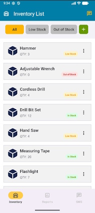
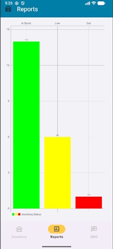
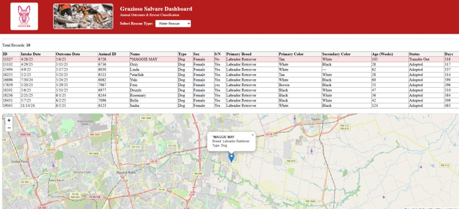
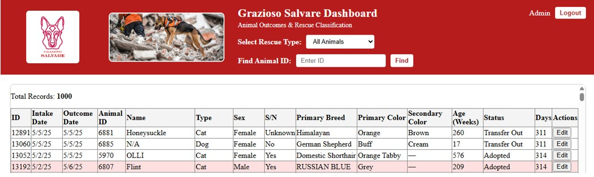
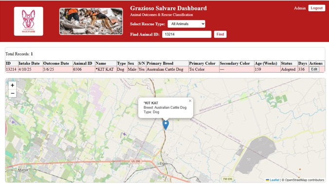
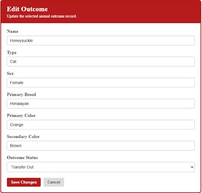

# CS499 Computer Science ePortfolio

## Introduction
My name is Grant McCord. I am a Computer Science student at Southern New Hampshire University with a background in C++ development and professional experience in software validation and programming. Throughout my program, I have expanded my skill set into full stack web development, mobile applications, databases, and software engineering practices.

This ePortfolio highlights my growth through selected artifacts that I enhanced during my capstone course. These artifacts demonstrate my abilities in software design, algorithms and data structures, and database development.

---

## Table of Contents
- Professional Self-Assessment
- Code Review
- Software Design and Engineering: Android Inventory App Enhancement
- Algorithms and Data Structures: Grazioso Salvare MEAN Stack Enhancement
- Databases: Grazioso Salvare MEAN Stack Enhancement

---

## Professional Self-Assessment

Throughout my Computer Science program, I developed both technical skills and a broader understanding of how software is designed, built, and maintained. Coming into the program with experience in C++, I was already comfortable with programming concepts, but this program helped me expand into full stack development, databases, and modern software practices.

One of the biggest areas of growth for me was working across multiple layers of an application. In my MEAN stack project, I worked with MongoDB, Express, Angular, and Node.js to build a complete web application. This required me to understand how front-end and back-end systems communicate, how APIs are structured, and how data flows through the application.

I also gained experience with data structures and algorithms through coursework and applied those concepts in my projects. For example, I implemented sorting and filtering logic in my applications and worked with structured data returned from databases to improve usability and performance.

Database development was another key area. I worked with both SQL and MongoDB, learning how to design schemas, write queries, and manage data effectively. In my MEAN stack project, I used MongoDB to store and retrieve records and implemented CRUD operations through an API.

Security concepts also played an important role in my development. Through my secure coding coursework, I learned the importance of input validation, avoiding hardcoded credentials, and designing systems with security in mind.

Overall, this program helped me transition from primarily working in C++ to being comfortable with full stack development. It also reinforced the importance of writing clean, maintainable code and thinking about software from both a user and system perspective.

The artifacts included in this portfolio demonstrate my growth across software engineering, algorithms and data structures, and database design.

---

## Code Review

[\[Code Review\]](https://youtu.be/iGguOwgDV1g)

In this code review, I walk through the original functionality of my applications, identify areas for improvement, and explain the enhancements I implemented. The focus is on improving structure, expanding functionality, and strengthening database integration.

---

## Software Design and Engineering: Android Inventory App Enhancement

### Artifact Description
The artifact used for this category is my Android Inventory Application, originally developed as part of my mobile development coursework. The application allows users to manage inventory items, including tracking stock levels and organizing product data.

### Justification for Inclusion
I selected this artifact because it demonstrates my ability to design and build a functional mobile application using Java and Android development tools. It also shows how I improved an existing application by expanding its functionality and improving its usability.

### Enhancements Implemented
The enhancements I made include adding stock status classification and implementing sorting functionality. These changes improved the usability of the application by making it easier to identify inventory levels and organize items efficiently.

I also added a reports page to provide a visual overview of the inventory data. This page includes a bar chart that displays the number of items that are in stock, low stock, and out of stock. The goal of this feature was to make it easier to quickly understand inventory trends without needing to scan through individual records.

### Reflection
Working on this enhancement helped reinforce the importance of designing applications with the user in mind. One challenge was ensuring that the new features integrated cleanly with the existing code without breaking functionality. Through this process, I improved my ability to modify and extend existing applications.

---

## Algorithms and Data Structures: Grazioso Salvare MEAN Stack Enhancement

### Artifact Description
This artifact is a MEAN stack web application based on the Grazioso Salvare project. It uses MongoDB, Express, Angular, and Node.js to manage and display animal rescue data.

### Justification for Inclusion
Web stack development is a critical skill in today’s workplace, and I chose this project because it is complex enough to clearly demonstrate the course outcomes I’ve achieved. I knew going into it that it would require a significant amount of work, integration, and testing—and it did—but that is also what makes it valuable. This artifact shows my ability to design, build, and integrate a full-stack application while applying algorithms, data structures, and real-world development practices.

This project also demonstrates my ability to develop a single-page application (SPA) that interacts directly with a MongoDB database to retrieve, display, and edit records. Through this work, I was able to connect a frontend interface with a backend API and database, showing how data flows through the entire system in a practical, real-world scenario.

### Enhancements Implemented
Enhancements included implementing sorting and filtering logic for rescue data, as well as handling aggregated results from the database. These changes improved the efficiency and usability of the application by allowing users to quickly find relevant information.

### Reflection
This enhancement helped me better understand how data structures and algorithms are applied in real-world applications. One challenge was ensuring that data was processed efficiently while still keeping the code readable and maintainable.

---

## Databases: Grazioso Salvare MEAN Stack Enhancement

### Artifact Description
This artifact is the same MEAN stack application, with a focus on the database layer using MongoDB. The goal of this enhancement was to demonstrate how the application interacts with the database beyond basic data retrieval, and to show a better understanding of full CRUD operations and data flow between the front end and back end.

I added a basic admin login, record lookup, and edit functionality. The admin login uses a simple hard-coded username and password along with a session identifier. This was intentionally kept lightweight since the goal was to demonstrate how authentication connects across the stack rather than build a fully secure system. Even though it is simple, it shows how user access can be controlled before allowing changes to data.

I also implemented record lookup by ID, which allows a specific record to be retrieved from MongoDB instead of just displaying all records. This required updating the Express routes to support fetching a single document and connecting that to the Angular front end. Once a record is selected, the application routes to a separate edit page where the data can be modified.

The edit functionality interacts directly with the database by sending updated data back through the API and performing an update operation in MongoDB. Not every field is editable, but the main fields can be changed, which demonstrates how updates are handled in a real application. This also required handling state between pages and making sure the correct record data is loaded before editing.

### Justification for Inclusion
I selected this artifact because it demonstrates my ability to design and interact with a database in a full stack application.

### Enhancements Implemented
I expanded the database functionality by implementing CRUD operations, adding API endpoints to retrieve and update records, and using MongoDB queries and aggregation to process data.

These enhancements allowed the application to support more complex interactions with the database and improved overall functionality.

### Reflection
Overall, these enhancements show a deeper understanding of how the database layer works within a full-stack application. Instead of just reading data, the application now supports retrieving specific records and updating them, which better reflects real-world use cases.

---

## Conclusion

The artifacts included in this portfolio represent my growth as a developer throughout the Computer Science program. From mobile development to full stack applications, I have gained experience in multiple areas of software development.

These projects demonstrate my ability to design, build, and enhance applications while applying best practices in software engineering, algorithms, and database management.